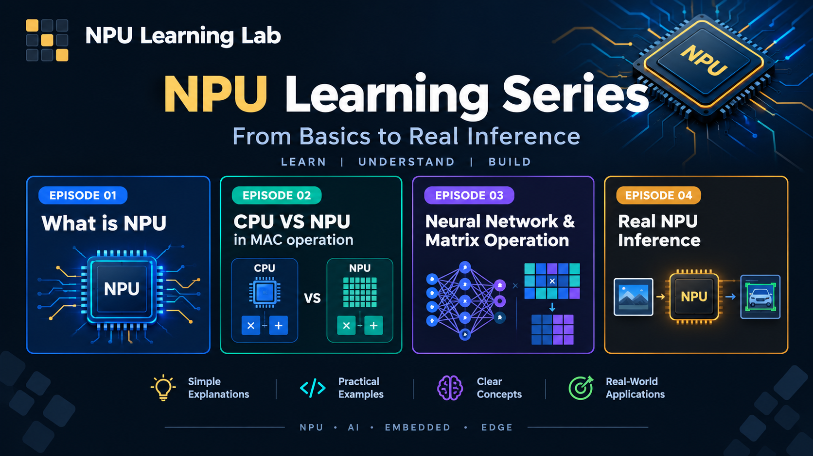

# NPU Learning Lab

**NPU Learning Lab** is a hands-on learning series focused on understanding Neural Processing Units (NPUs), AI inference, and Embedded AI through visual explanations, animations, and practical concepts.

## YouTube Series

Watch the complete **NPU Learning Lab** series:

## Interactive Learning Lab

Explore the interactive web-based learning environment:

https://embeddedailab.github.io/NPULearningLab/

## Windows Application

A standalone Windows `.exe` version is available in the **GitHub Releases** section.

**To run:**

1. Download the latest `.exe` from Releases.
2. Double-click the downloaded `.exe` file.
3. The NPU Learning Lab will launch.

No additional setup is required.

## Contact

For questions, feedback, or source-code related queries:

**embeddedailab.official@gmail.com**

---

Created for learning and educational purposes, with a focus on **Embedded AI, Edge AI, NPU acceleration, AI inference, and C/C++ development**.